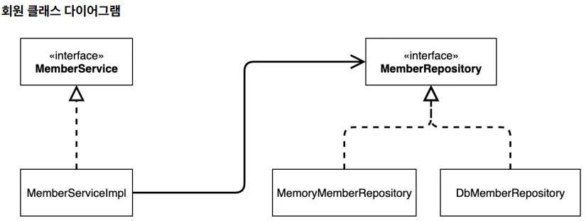
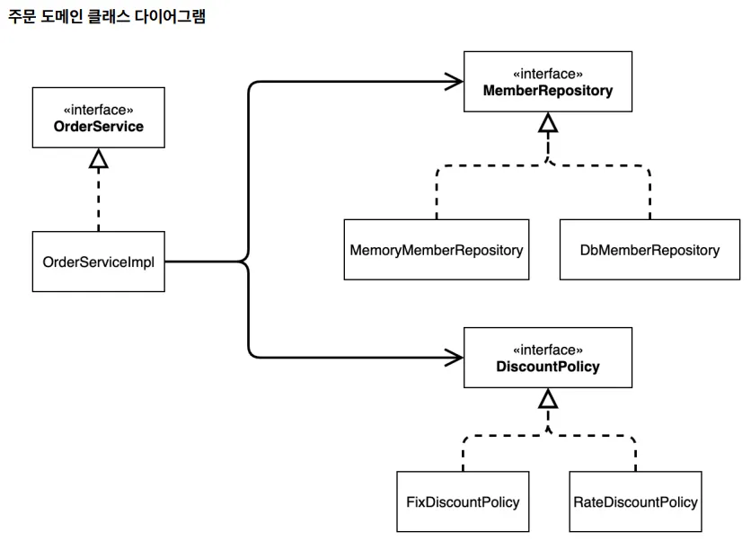

## DIP, OCP 위배

### 문제 상황이 발생하는 코드

- 인터페이스에만 의존해야 하는데, 구현 클래스를 직접 `new`로 생성한다.

### 해결 방법

- `private final MemberRepository memberRepository;` 와 같이 인터페이스에만 의존하도록 설계를 변경해야 한다.
- 대신 누군가가 구현 객체를 대신 생성하고 주입해주어야 한다.
- 그 누군가가 바로 AppConfig! 구현 객체를 생성하고 연결하는 책임을 가지는 별도의 클래스이다.
- 기존에는 개발자가 AppConfig 를 사용해서 직접 객체를 생성하고 DI를 했지만, 이제부터는 스프링 컨테이너를 통해서 사용한다

```java
package hello.core;

import hello.core.discount.DiscountPolicy;
import hello.core.discount.FixDiscountPolicy;
import hello.core.discount.RateDiscountPolicy;
import hello.core.member.MemberService;
import hello.core.member.MemberServiceImpl;
import hello.core.member.MemoryMemberRepository;
import hello.core.order.OrderService;
import hello.core.order.OrderServiceImpl;
import org.springframework.context.annotation.Bean;
import org.springframework.context.annotation.Configuration;

@Configuration //AppConfig에 설정을 구성한다는 뜻
public class AppConfig {
    @Bean //스프링 컨테이너에 스프링 빈으로 등록한다.
    public MemberService memberService() {
        return new MemberServiceImpl(memberRepository());
    }

    @Bean
    public MemoryMemberRepository memberRepository() {
        return new MemoryMemberRepository();
    }

    @Bean
    public OrderService orderService() {
        return new OrderServiceImpl(
                memberRepository(), discountPolicy());
    }

    @Bean
    public DiscountPolicy discountPolicy() {
        return new RateDiscountPolicy();
    }
```

### 스프링 컨테이너

- `ApplicationContext` 를 스프링 컨테이너라 한다.
- `ApplicationContext`는 인터페이스이다.
- 스프링 컨테이너는 XML을 기반으로 만들 수 있고, 애노테이션 기반의 자바 설정 클래스로 만들 수 있다.
- 스프링 컨테이너는 `@Configuration`이 붙은 AppConfig 를 설정(구성) 정보로 사용한다. 여기서 `@Bean` 이라 적힌 메서드를 모두 호출해서 반환된 객체를 스프링 컨테이너에 등록한다. 이렇게 스프링 컨테이너에 등록된 객체를 스프링 빈이라 한다.
- 스프링 빈은 @Bean 이 붙은 메서드의 명을 스프링 빈의 이름으로 사용한다. ( `memberService` , `orderService` )
- 이전에는 개발자가 필요한 객체를 `AppConfig` 를 사용해서 직접 조회했지만, 이제부터는 스프링 컨테이너를 통해서 필요한 스프링 빈(객체)를 찾아야 한다. 스프링 빈은 `applicationContext.getBean()` 메서드를 사용해서 찾을 수 있다.

### 예시 문제 1 - 회원 도메인



```java
package hello.core.member;

import org.springframework.beans.factory.annotation.Autowired;
import org.springframework.stereotype.Component;

@Component
public class MemberServiceImpl implements MemberService{

    private final MemberRepository memberRepository = new MemoryMemberRepository();

    @Override
    public void join(Member member) {
        memberRepository.save(member);
    }

    @Override
    public Member findMember(Long memberId) {
        return memberRepository.findById(memberId);
    }
}
```

```java
package hello.core;

import hello.core.member.Grade;
import hello.core.member.Member;
import hello.core.member.MemberService;
import hello.core.member.MemberServiceImpl;
import org.springframework.context.ApplicationContext;
import org.springframework.context.annotation.AnnotationConfigApplicationContext;

public class MemberApp {
    public static void main(String[] args) {

        MemberService memberService = new memberServiceImpl();
        
        Member member = new Member(1L, "memberA", Grade.VIP);
        memberService.join(member);

        Member findMember = memberService.findMember(1L);
        System.out.println("new member = " + member.getName());
        System.out.println("find Member = " + findMember.getName());
    }
}
```

### 예시 문제 1 - 해결 코드

- MemberServiceImple 클래스에 생성자를 주입한다. 그러면 생성자를 통해서 어떤 구현 객체를 주입할지는 오직 외부(AppConfig)에서 결정된다.

```java
package hello.core.member;

import org.springframework.beans.factory.annotation.Autowired;
import org.springframework.stereotype.Component;

@Component
public class MemberServiceImpl implements MemberService{

    private final MemberRepository memberRepository;

    // @Autowired 생략 가능 (생성자가 하나뿐일 때)
    // 생성자가 여러 개일 땐 주입에 사용할 생성자 한 곳에만 @Autowired
    public MemberServiceImpl(MemberRepository memberRepository) {
        this.memberRepository = memberRepository;
    }

    @Override
    public void join(Member member) {
        memberRepository.save(member);
    }

    @Override
    public Member findMember(Long memberId) {
        return memberRepository.findById(memberId);
    }
}
```

- MemberApp 클래스 코드 변경

```java
package hello.core;

import hello.core.member.Grade;
import hello.core.member.Member;
import hello.core.member.MemberService;
import hello.core.member.MemberServiceImpl;
import org.springframework.context.ApplicationContext;
import org.springframework.context.annotation.AnnotationConfigApplicationContext;

public class MemberApp {
    public static void main(String[] args) {
//        자바 버전
//        AppConfig appConfig = new AppConfig();
//        MemberService memberService = appConfig.memberService();

//        스프링 버전
        ApplicationContext applicationContext = new AnnotationConfigApplicationContext(AppConfig.class);
        MemberService memberService = applicationContext.getBean("memberService", MemberService.class);

        Member member = new Member(1L, "memberA", Grade.VIP);
        memberService.join(member);

        Member findMember = memberService.findMember(1L);
        System.out.println("new member = " + member.getName());
        System.out.println("find Member = " + findMember.getName());
    }
}

```

### 예시 문제 2 - 주문과 할인 도메인



```java
package hello.core.order;

import hello.core.discount.DiscountPolicy;
import hello.core.discount.FixDiscountPolicy;
import hello.core.member.Member;
import hello.core.member.MemberRepository;
import hello.core.member.MemoryMemberRepository;
import org.springframework.stereotype.Component;

@Component
public class OrderServiceImpl implements OrderService{

    private final MemberRepository memberRepository = new MemoryMemberRepository();
    private final DiscountPolicy discountPolicy = new FixDiscountPolicy();

    @Override
    public Order createOrder(Long memberId, String itemName, int itemPrice) {
        Member member = memberRepository.findById(memberId);
        int discountPrice = discountPolicy.discount(member, itemPrice);
        return new Order(memberId, itemName, itemPrice, discountPrice);
    }
```

```java
package hello.core;

import hello.core.member.Grade;
import hello.core.member.Member;
import hello.core.member.MemberService;
import hello.core.member.MemberServiceImpl;
import hello.core.order.Order;
import hello.core.order.OrderService;
import hello.core.order.OrderServiceImpl;
import org.springframework.context.ApplicationContext;
import org.springframework.context.annotation.AnnotationConfigApplicationContext;

public class OrderApp {
    public static void main(String[] args) {
        MemberService memberService = new MemberServiceImpl();
        OrderService orderService = new OrderServiceImpl();

        long memberId = 1L;
        Member member = new Member(memberId, "memberA", Grade.VIP);
        memberService.join(member);

        Order order = orderService.createOrder(memberId, "itemA", 10000);
        System.out.println("order = " + order);

    }
}

```

### 예시 문제 2 - 해결 코드

```java
package hello.core.order;

import hello.core.annotation.MainDiscountPolicy;
import hello.core.discount.DiscountPolicy;
import hello.core.member.Member;
import hello.core.member.MemberRepository;
import lombok.RequiredArgsConstructor;
import org.springframework.beans.factory.annotation.Autowired;
import org.springframework.stereotype.Component;

@Component
public class OrderServiceImpl implements OrderService{

    private final MemberRepository memberRepository;
    private final DiscountPolicy discountPolicy;

    // 생성자 자동 주입
    @Autowired
    public OrderServiceImpl(MemberRepository memberRepository, @MainDiscountPolicy DiscountPolicy discountPolicy) {
        this.memberRepository = memberRepository;
        this.discountPolicy = discountPolicy;
    }

    @Override
    public Order createOrder(Long memberId, String itemName, int itemPrice) {
        Member member = memberRepository.findById(memberId);
        int discountPrice = discountPolicy.discount(member, itemPrice);
        return new Order(memberId, itemName, itemPrice, discountPrice);
    }
}

```

```java
package hello.core;

import hello.core.member.Grade;
import hello.core.member.Member;
import hello.core.member.MemberService;
import hello.core.member.MemberServiceImpl;
import hello.core.order.Order;
import hello.core.order.OrderService;
import hello.core.order.OrderServiceImpl;
import org.springframework.context.ApplicationContext;
import org.springframework.context.annotation.AnnotationConfigApplicationContext;

public class OrderApp {
    public static void main(String[] args) {
//        자바 버전
//        AppConfig appConfig = new AppConfig();
//        MemberService memberService = appConfig.memberService();
//        OrderService orderService = appConfig.orderService();

//        스프링 버전
        ApplicationContext applicationContext = new AnnotationConfigApplicationContext(AppConfig.class);
        MemberService memberService = applicationContext.getBean("memberService", MemberService.class);
        OrderService orderService = applicationContext.getBean("orderService", OrderService.class);

        long memberId = 1L;
        Member member = new Member(memberId, "memberA", Grade.VIP);
        memberService.join(member);

        Order order = orderService.createOrder(memberId, "itemA", 10000);
        System.out.println("order = " + order);

    }
}

```

## 제어의 역전 - IoC (Inversion of Control)

- = 객체 생성과 의존 관계 관리의 제어권을 개발자가 아니라 외부 컨테이너(프레임워크)가 담당하도록 뒤바꾸는 것
- 객체 생성과 의존성 연결은 AppConfig(스프링 컨테이너)가 담당.
- 클라이언트 코드(MemberApp)는 오직 인터페이스(MemberService)만 알고 사용한다.
- 구현체를 바꾸려면 AppConfig만 수정하면 되고, 클라이언트 코드는 그대로 둔다.

## 프레임워크 vs 라이브러리

- 프레임워크와 라이브러리의 가장 큰 차이는 **제어권**이다.
- 프레임워크는 제어의 역전(IoC)을 통해 애플리케이션의 흐름을 주도하고, 저는 프레임워크가 정한 규칙에 맞춰 코드만 작성하면 됩니다.
- 반면 라이브러리는 특정 기능만 제공할 뿐, **언제·어떻게 쓸지**는 전적으로 개발자가 결정한다.
- 예를 들어 스프링은 요청이 오면 컨트롤러 메서드를 **스프링이 호출**하는 프레임워크이고, JUnit이나 Apache Commons는 개발자가 필요할 때 직접 호출하는 라이브러리이다.

## 의존 관계 주입 - DI (Dependency Injection)

- = 애플리케이션 실행 시점(런타임)에 외부에서 실제 구현 객체를 생성하고 클라이언트에 전달해서 클라이언트와 서버의 실제 의존관계가 연결 되는 것
- 의존관계 주입을 사용하면 클라이언트 코드를 변경하지 않고, 클라이언트가 호출하는 대상의 타입 인스턴스를 변경할 수 있다.

## IoC 컨테이너, DI 컨테이너

- = AppConfig 처럼 객체를 생성하고 관리하면서 의존관계를 연결해 주는 것
- 의존관계 주입에 초점을 맞추어 최근에는 주로 DI 컨테이너라 한다.