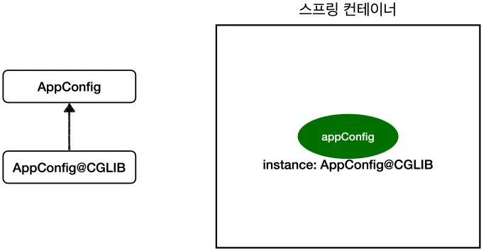

## 웹 애플리케이션과 싱글톤

- 스프링 없는 순수한 DI 컨테이너의 문제점
    - 요청할 때마다 객체 생성 → 메모리 낭비 심하다.
    - 해결 방안: 객체가 딱 1개만 생성되고 공유되도록 설계 = 싱글톤 패턴

## 싱글톤 패턴

- 싱글톤 패턴이란?
    - = 클래스 인스턴스가 딱 1개만 생성되는 것을 보장하는 디자인 패턴
- 싱글톤 패턴 직접 구현하는 방법은?
    - **static 영역에 인스턴스 생성** → “어디서나 접근 가능한 단 하나의 객체”를 준비.
    - **getInstance() 메서드** → 외부에서 오직 이 경로로만 인스턴스를 조회하도록 통제.
    - **private 생성자** → 외부에서 `new`로 새로운 객체를 만들 수 없게 막음.
- 문제점
    - 코드가 많다.
    - 구체 클래스에 의존하여 DIP와 OCP를 위반한다.
    - 테스트, 내부 속성 변경 및 초기화, 자식 클래스 생성 등이 어려워 유연성이 낮다.
    - 안티패턴이라고도 불린다.

## 싱글톤 컨테이너

- 스프링 컨테이너 (싱글톤 컨테이너) 장점
    - 싱글톤 패턴의 문제를 해결함과 동시에 **객체 인스턴스를 싱글톤으로 관리할 수 있게 해준다.**
    - 고객의 요청이 올 때 마다 객체를 생성하는 것이 아니라, **이미 만들어진 객체를 공유해서 효율적으로 재사용할 수 있다.**
    - 싱글톤 패턴을 위한 지저분한 코드가 들어가지 않아도 된다.
    - **DIP, OCP, 테스트, private 생성자로 부터 자유롭게 싱글톤을 사용할 수 있다.**
- 싱글톤 레지스트리
    - = 싱글톤 객체 생성 및 관리 기능
- 싱글톤 컨테이너 사용 방법
    - `ApplicationContext ac = new AnnotationConfigApplicationContext(AppConfig.class)`

## 싱글톤 방식의 주의점

- 싱글톤 방식을 사용할 때 주의해야할 점은?
    - 여러 클라이언트가 하나의 같은 객체 인스턴스를 공유하기 때문에 싱글톤 객체는 상태를 유지(stateful)하게 설계하면 안된다. 무상태(stateless)로 설계해야 한다.
        - 클라이언트에 의존하면 안 된다.
        - 클라이언트가 값을 변경하도록 하면 안 된다.
        - 가급적 읽기만 가능하도록 한다.
        - 필드는 만들지 않고, 지역변수/파라미터/ThreadLocal 등을 사용해야 한다.
- 문제 코드 예시

    ```java
    package hello.core.singleton;
    
    public class StatefulService {
        private int price; //상태를 유지하는 필드
    
        public void order(String name, int price) {
            System.out.println("name = " + name + " price = " + price);
            this.price = price; //여기가 문제!
        }
    
        public int getPrice() {
            return price;
        }
    }
    ```

    ```java
    package hello.core.singleton;
    
    import org.assertj.core.api.Assertions;
    import org.junit.jupiter.api.Test;
    import org.springframework.context.ApplicationContext;
    import org.springframework.context.annotation.AnnotationConfigApplicationContext;
    import org.springframework.context.annotation.Bean;
    
    public class StatefulServiceTest {
        // 상태를 유지하는 서비스는 싱글톤으로 만들면 안된다.
        @Test
        void statefulServiceSingleton() {
            ApplicationContext ac = new AnnotationConfigApplicationContext(TestConfig.class);
            StatefulService statefulService1 = ac.getBean("statefulService", StatefulService.class);
            StatefulService statefulService2 = ac.getBean("statefulService", StatefulService.class);
    
            //ThreadA: A사용자 10000원 주문
            statefulService1.order("userA", 10000);
            //ThreadB: B사용자 20000원 주문
            statefulService2.order("userB", 20000);
    
            //ThreadA: 사용자A 주문 금액 조회
            int price = statefulService1.getPrice();
    
            //ThreadA: 사용자A는 10000원을 기대했지만, 기대와 다르게 20000원 출력
            System.out.println("price = " + price);
            Assertions.assertThat(statefulService1.getPrice()).isEqualTo(20000);
        }
    
        static class TestConfig {
            @Bean
            public StatefulService statefulService() {
                return new StatefulService();
            }
        }
    }
    ```

- 문제 코드 해결 방법
    - **무상태(Stateless)** 로 바꾸려면, **공유 필드를 제거**하고 메서드가 필요한 값을 바로 반환하도록 수정하면 됩니다.

    ```java
    package hello.core.singleton;
    
    public class StatelessService {
    
        // 상태를 저장하지 않는다.
        public int order(String name, int price) {
            System.out.println("name = " + name + " price = " + price);
            return price; // 바로 반환 → 공유 필드 없음
        }
    }
    ```

    ```java
    package hello.core.singleton;
    
    import org.assertj.core.api.Assertions;
    import org.junit.jupiter.api.Test;
    import org.springframework.context.ApplicationContext;
    import org.springframework.context.annotation.AnnotationConfigApplicationContext;
    import org.springframework.context.annotation.Bean;
    
    public class StatelessServiceTest {
    
        @Test
        void statelessServiceSingleton() {
            ApplicationContext ac = new AnnotationConfigApplicationContext(TestConfig.class);
            StatelessService statelessService1 = ac.getBean("statelessService", StatelessService.class);
            StatelessService statelessService2 = ac.getBean("statelessService", StatelessService.class);
    
            // ThreadA: A사용자 10000원 주문
            int userAPrice = statelessService1.order("userA", 10000);
            // ThreadB: B사용자 20000원 주문
            int userBPrice = statelessService2.order("userB", 20000);
    
            // 각 사용자가 자신의 금액만 받음 → 공유 데이터 없음
            System.out.println("userAPrice = " + userAPrice);
            Assertions.assertThat(userAPrice).isEqualTo(10000);
        }
    
        static class TestConfig {
            @Bean
            public StatelessService statelessService() {
                return new StatelessService();
            }
        }
    }
    ```


## @Configuration과 싱글톤

- 코드

    ```java
    package hello.core;
    
    @Configuration
    public class AppConfig {
        @Bean
        public MemberService memberService() {
            return new MemberServiceImpl(memberRepository());
        }
    
        @Bean
        public MemoryMemberRepository memberRepository() {
            return new MemoryMemberRepository();
        }
    
        @Bean
        public OrderService orderService() {
            return new OrderServiceImpl(
                    memberRepository(), discountPolicy());
        }
    
        @Bean
        public DiscountPolicy discountPolicy() {
            return new RateDiscountPolicy();
        }
    }
    
    ```

- 위 코드에서 `new MemoryMemberRepository()` 를 3번 호출하는 것 같다. 그러면 싱글톤이 깨지는 것 아닐까? 스프링은 이를 어떻게 관리하는 걸까?

## @Configuration과 바이트코드 조작의 마법

- 스프링은 자바 코드 조작은 못한다. 대신 클래스의 바이트코드를 조작하는 라이브러리를 사용한다.
- 모든 비밀은 @Configuration 을 적용한 AppConfig 에 있다.

```java
@Test
void configurationDeep() {
	ApplicationContext ac = new AnnotationConfigApplicationContext(AppConfig.class);
	//AppConfig도 스프링 빈으로 등록된다.
	AppConfig bean = ac.getBean(AppConfig.class);
	System.out.println("bean = " + bean.getClass());
	//출력: bean = class hello.core.AppConfig$$EnhancerBySpringCGLIB$$bd479d70
}
```

- 그 라이브러리는?
    - CGLIB라는 바이트코드 조작 라이브러리이다.
        - Spring은 `@Configuration` 클래스를 처리할 때 내부적으로 CGLIB 프록시를 생성해서 사용합니다.
        - 스프링은 CGLIB라는 바이트코드 조작 라이브러리로 AppConfig 클래스를 상속받은 임의의 다른 클래스로 만들고 그 다른 클래스를 스프링 빈으로 등록한다.
        - 그 임의의 다른 클래스가 바로 싱글톤이 보장되도록 해준다.
        - @Bean이 붙은 메서드마다 이미 스프링 빈이 존재하면 존재하는 빈을 반환하고, 스프링 빈이 없으면 생성해서 스프링 빈으로 등록하고 반환하는 코드가 동적으로 만들어진다.

    

- 만약 @Configuration은 사용하지 않고  @Bean만 사용하면 어떻게 될까?
    - 스프링 빈으로 등록은 되지만, 싱글톤이 보장되지 않는다.
    - 그러니까 항상 @Configuration을 사용해야 한다.