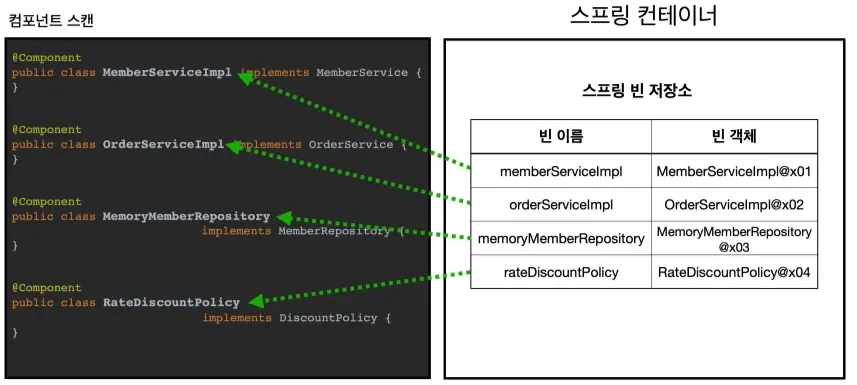
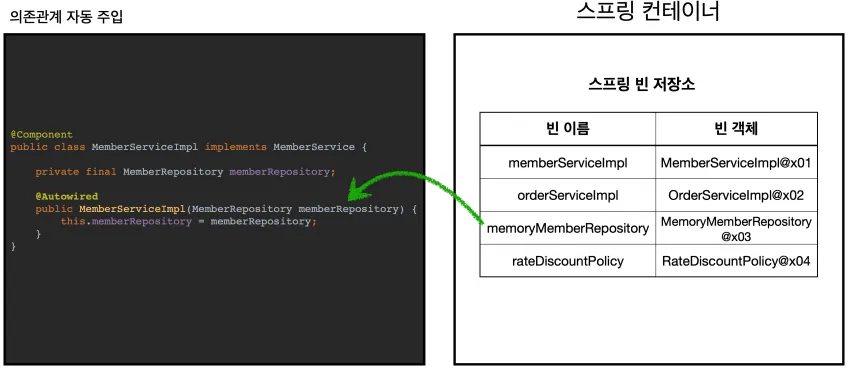

## 컴포넌트 스캔과 의존관계 자동 주입 시작하기

- 컴포넌트 스캔이란?
    - 지금까지 스프링 빈을 등록할 때는 자바 코드의 @Bean이나 XML의 <bean> 등을 통해서 설정 정보에 직접 등록할 스프링 빈을 나열했다.
    - 스프링은 **설정 정보가 없어도 자동으로 스프링 빈을 등록**하는 컴포넌트 스캔이라는 기능을 제공한다.
- 컴포넌트 스캔 방법
    - `@ComponentScan` 을 설정 정보에 붙여주면 된다.
    - 기존의 AppConfig와는 다르게 클래스를 @Bean으로 등록하지 않아도 된다.
    - 각 클래스가 컴포넌트 스캔 대상이 되도록 `@Component` 애노테이션을 붙여준다.
    - 의존 관계가 자동으로 주입되도록 각 생성자에 `@Autowired` 애노테이션을 붙여준다.
    - 그러면 `@Component` 애노테이션이 붙은 클래스를 스캔해서 스프링 빈으로 등록하고, `@Autowired` 가 붙어있는 생성자에 있는 파라미터에 대하여 의존관계를 자동으로 주입해준다.
- 의존관계 자동 주입 방법
    - `@Autowired` 를 클래스의 생성자에 붙여주면 된다.
- 컴포넌트 스캔과 자동 의존관계 주입 동작 방식

    1. `@ComponentScan`
        
                
        - `@ComponentScan` 은 `@Component` 가 붙은 모든 클래스를 스프링 빈으로 등록한다.
        - 이때 스프링 빈의 기본 이름은 클래스명을 사용하되 맨 앞글자만 소문자를 사용한다.
            - 빈 이름 기본 전략: `MemberServiceImpl` 클래스 → `memberServiceImpl`
            - 빈 이름 직접 지정: 만약 스프링 빈의 이름을 직접 지정하고 싶으면 `@Component("memberService2")` 이런 식으로 이름을 부여하면 된다.
    
    2. `@Autowired` 의존 관계 주입
     
    - 생성자에 `@Autowired` 를 지정하면, 스프링 컨테이너가 자동으로 해당 스프링 빈을 찾아서 주입한다.
    - 이때 기본 조회 전략은 타입이 같은 빈을 찾아서 주입한다. `getBean(MemberRepository.class)`와 동일하다고 이해하면 된다.

## 탐색 위치와 기본 스캔 대상

- 모든 자바 클래스를 다 컴포넌트 스캔하면 시간이 오래 걸린다. 그래서 꼭 필요한 위치부터 탐색하도록 시작 위치를 지정할 수 있다.
- 탐색할 패키지의 시작 위치 지정 **방법**

    ```java
    @ComponentScan(
     basePackages = "hello.core",
    }
    ```

    - `basePackages` : 탐색할 패키지의 시작 위치를 지정한다. 이 패키지를 포함해서 하위 패키지를 모두 탐색한다.
        - `basePackages = {"hello.core", "hello.service"}` 이렇게 여러 시작 위치를 지정할 수도 있다.
    - `basePackageClasses` : 지정한 클래스의 패키지를 탐색 시작 위치로 지정한다.
    - 만약 지정하지 않으면 `@ComponentScan`이 붙은 설정 정보 클래스의 패키지가 시작 위치가 된다.
- 탐색할 패키지의 시작 위치 지정 **관례**
    - 패키지 위치를 지정하지 않고, 설정 정보 클래스의 위치를 프로젝트 최상단에 두는 것
    - 예를 들어서 프로젝트가 다음과 같이 구조가 되어 있으면

    <aside>

  com.hello

  com.hello.serivce

  com.hello.repository

    </aside>

    - com.hello가 프로젝트 시작 루트이다.
    - 여기에 AppConfig 같은 메인 설정 정보를 두고, @ComponentScan 애노테이션을 붙이고, basePackages 지정은 생략한다.
    - 참고로 스프링 부트를 사용하면 스프링 부트의 대표 시작 정보인 @SpringBootApplication 를 이 프로젝트 시작 루트 위치에 두는 것이 관례이다. (그리고 이 설정안에 바로 @ComponentScan 이 들어있다!)
- 컴포넌트 스캔 기본 대상
    - 컴포넌트 스캔은 @Component 뿐만 아니라 다음과 내용도 추가로 대상에 포함한다.
    - @Configuration : 스프링 설정 정보에서 사용
    - @Component : 컴포넌트 스캔에서 사용
    - @Controller : 스프링 MVC 컨트롤러에서 사용
    - @Service : 스프링 비즈니스 로직에서 사용
    - @Repository : 스프링 데이터 접근 계층에서 사용
    - 해당 클래스의 소스 코드를 보면 @Component 를 포함하고 있는 것을 알 수 있다.
    - 컴포넌트 스캔의 용도 뿐만 아니라 위의 애노테이션이 있으면 스프링은 부가 기능을 수행한다.
        - @Configuration : 앞서 보았듯이 스프링 설정 정보로 인식하고, 스프링 빈이 싱글톤을 유지하도록 추가 처리를 한다.
        - @Controller : 스프링 MVC 컨트롤러로 인식
        - @Repository : 스프링 데이터 접근 계층으로 인식하고, 데이터 계층의 예외를 스프링 예외로 변환해준다.
        - @Service : 사실 @Service 는 특별한 처리를 하지 않는다. 대신 개발자들이 핵심 비즈니스 로직이 여기에 있겠구나 라고 비즈니스 계층을 인식하는데 도움이 된다.

## 필터

- `includeFilters` 란?

  컴포넌트 스캔 대상을 추가로 지정한다.

- `excludeFilters` 란?

  컴포넌트 스캔에서 제외할 대상을 지정한다.

- `includeFilters` 와 `excludeFilters`  사용 방법

    ```java
    package hello.core.scan.filter;
    
    import java.lang.annotation.*;
    
    @Target(ElementType.TYPE)
    @Retention(RetentionPolicy.RUNTIME)
    @Documented
    public @interface MyIncludeComponent {
    }
    ```

    ```java
    package hello.core.scan.filter;
    
    import java.lang.annotation.*;
    
    @Target(ElementType.TYPE)
    @Retention(RetentionPolicy.RUNTIME)
    @Documented
    public @interface MyExcludeComponent {
    }
    ```

    ```java
    package hello.core.scan.filter;
    
    @MyIncludeComponent
    public class BeanA {
    }
    ```

    ```java
    package hello.core.scan.filter;
    
    @MyExcludeComponent
    public class BeanB {
    }
    ```

    ```java
    
    package hello.core.scan.filter;
    
    import org.junit.jupiter.api.Assertions;
    import org.junit.jupiter.api.Test;
    import org.springframework.beans.factory.NoSuchBeanDefinitionException;
    import org.springframework.context.ApplicationContext;
    import org.springframework.context.annotation.AnnotationConfigApplicationContext;
    import org.springframework.context.annotation.ComponentScan;
    import org.springframework.context.annotation.Configuration;
    import org.springframework.context.annotation.FilterType;
    
    import static org.assertj.core.api.Assertions.assertThat;
    import static org.springframework.context.annotation.ComponentScan.Filter;
    
    public class ComponentFilterAppConfigTest {
        @Test
        void filterScan() {
            ApplicationContext ac = new AnnotationConfigApplicationContext(ComponentFilterAppConfig.class);
            BeanA beanA = ac.getBean("beanA", BeanA.class);
            assertThat(beanA).isNotNull();
    
            Assertions.assertThrows(
                    NoSuchBeanDefinitionException.class,
                    () -> ac.getBean("beanB", BeanB.class));
        }
    
        @Configuration
        @ComponentScan(
                includeFilters = @Filter(type = FilterType.ANNOTATION, classes = MyIncludeComponent.class),
                excludeFilters = @Filter(type = FilterType.ANNOTATION, classes = MyExcludeComponent.class)
        )
        static class ComponentFilterAppConfig {
        }
    }
    ```

- FilterType 옵션
    - `ANNOTATION`

      기본값, 애노테이션을 인식해서 동작한다.

      ex) org.example.SomeAnnotation

    - `ASSIGNABLE_TYPE`

      지정한 타입과 자식 타입을 인식해서 동작한다.

      ex) org.example.SomeClass

    - `ASPECTJ`

      AspectJ 패턴 사용

      ex) org.example..*Service+*

    - `REGEX`

      정규 표현식

      ex) org\.example\.Default.

    - `CUSTOM`

      TypeFilter 이라는 인터페이스를 구현해서 처리

      ex) org.example.MyTypeFilter

    - 참고
        - `@Component` 면 충분하기 때문에, `includeFilters` 를 사용할 일은 거의 없다.
        - `excludeFilters` 는  여러 가지 이유로 간혹 사용할 때가 있지만 많지는 않다.
        - 특히 최근 스프링 부트는 컴포넌트 스캔을 기본으로 제공하는데, 개인적으로는 옵션을 변경하면서 사용하기 보다는 스프링의 기본 설정에 최대한 맞추어 사용하는 것을 권장하고, 선호하는 편이다.
- FilterType 예시
    - 예를 들어서 BeanA도 빼고 싶으면 다음과 같이 추가하면 된다.

    ```java
    ComponentScan(
     includeFilters = {
     @Filter(type = FilterType.ANNOTATION, classes = MyIncludeComponent.class),
     },
     
     excludeFilters = {
     @Filter(type = FilterType.ANNOTATION, classes = MyExcludeComponent.class),
     @Filter(type = FilterType.ASSIGNABLE_TYPE, classes = BeanA.class)
     }
    )
    ```


## 중복 등록과 충돌

- 자동 빈 등록 vs 자동 빈 등록
    - 컴포넌트 스캔에 의해 자동으로 스프링 빈이 등록되는데, 그 이름이 같은 경우 스프링은 오류를 발생시킨다.
    - `ConflictingBeanDefinitionException` 예외 발생
- 스프링에서 수동 빈 등록 vs 자동 빈 등록
    - 수동 빈 등록이 우선권을 가진다.
    - 수동 빈이 자동 빈을 오버라이딩 해버린다.
- 스프링 부트에서 수동 빈 등록 vs 자동 빈 등록
    - 스프링 부트에서는 수동 빈 등록과 자동 빈 등록이 충돌나면 오류가 발생하도록 기본 값을 바꾸었다.
    - 개발자가 의도적으로 설정해서 이런 결과가 만들어지기 보다는 여러 설정들이 꼬여서 이런 결과가 만들어지는 경우가 대부분이기 때문이다.